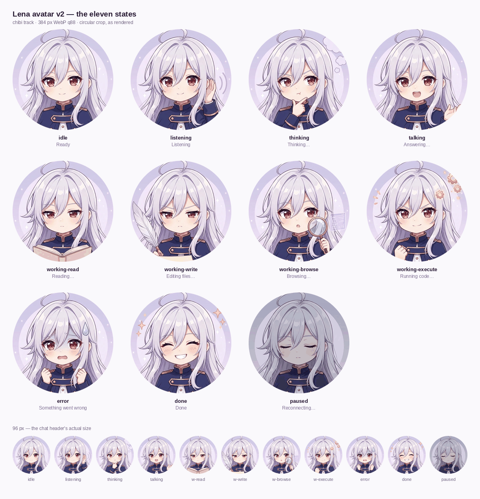

# Lena avatar runtime

An animated avatar of Lena in the chat header, driven in real time by the turn stream.

**The avatar is a pure view of the chat event stream.** It is never agent-controlled: there is no
channel by which a model can select its own expression, and adding one would be a protocol change,
not a code change here. See `docs/cloudflare-os-integration.md` § "Animated avatar" in the design
repo, and `docs/lena-avatar-v2-plan.md` for why v1's SVG rig was replaced.

## Layers

| file | role |
| --- | --- |
| `state.ts` | The `AvatarState` union and its captions. The renderer-agnostic seam. |
| `mapping.ts` | `AiChatStreamEvent` + turn boundaries → `AvatarState`, with hysteresis. No DOM, no clock. |
| `controller.ts` | The sink the existing chat subscriber feeds; publishes snapshots to React. |
| `portraits.ts` | The art table: `AvatarState` → one of eleven baked frames, plus the `paused` filter. |
| `LenaAvatar.tsx` | Cross-dissolves between frames; breathing and bob as compositor-only CSS. |
| `ChatAvatar.tsx` | Binds a controller to `LenaAvatar`, plus the status caption. |
| `art/` | Eleven 384 px WebP frames + `build-art.py`, the re-vendoring script. |
| `harness/` | Dev-only QA page. Not in the app bundle. |



Everything above `portraits.ts` is v1 code, unchanged: the event→mood machine was built to outlive
its renderer and did.

## The renderer

v1 drove a hand-authored 82-id SVG skeleton. The rig code was fine; the *authoring method* had a
ceiling, and on the contact sheet the eleven states were nearly indistinguishable. v2 replaces the
rig with eleven baked frames and a crossfade.

That works because of a property of the art: every frame is an image-model **edit of one anchor
frame**, so the whole set registers within a few pixels — eyes, hair silhouette and coat all land in
the same place. A plain opacity cross-dissolve therefore reads as Lena moving, because the only
things that visibly change across the dissolve are the parts the art changed. (`thinking` is the
loosest frame in the set and its hair edge ghosts slightly more than the others; see the art notes.)

Motion is three CSS animations and nothing else — no rAF loop, no per-frame DOM writes, no React
re-renders while a state holds:

| | |
| --- | --- |
| crossfade | 260 ms `opacity` on the incoming frame, stacked over the outgoing one |
| breathing | ~4.6 s `scale` oscillation, well under a pixel at 96 px |
| bob | a ~1.1° head tilt every ~11 s, at rest for most of the cycle |

Both transforms and the opacity are compositor properties, so once the frame is decoded there is
nothing left for the main thread to do. Measured the same way v1 was — CDP `TaskDuration` ÷ wall,
medians of 7 interleaved A/B intervals, one 96 px avatar:

| | main-thread task time |
| --- | --- |
| page floor, avatar hidden | 0.071 % |
| **+ one idle avatar** | **+0.000 %** |

against v1's **0.69 %**, which was almost entirely rasterizing the SVG afresh every frame. (This
counts main-thread work only; the compositor still animates two promoted layers, which is what it
is for.) The browser throttles the animations on its own while the tab is hidden.

Both motions are also shaped so they cannot uncover the backdrop inside the circle crop. The bob is
a *rotation* rather than a translation because the distance from a square's centre to each of its
edges is unchanged by rotation, so a rotated square still contains its own inscribed circle; a
translation would slide an edge across the crop and expose a crescent. `breathe` scales from the top
edge for the same reason, and because it means the face barely moves while the shoulders do — which
is also what breathing looks like.

There is no blink. The art has open eyes baked in, and faking one would cost a second frame per
state for a cue that does not survive to 96 px anyway. The bob is deliberately mostly *still*: a
continuous bob reads as a bouncing GIF, one that sits still for eight seconds reads as a person.

The art's ahoge runs off the top edge of the masters, so the circle crop clips it in every frame at
every size. That is the art's own framing, not the renderer's — it is visible on the contact sheet
above and was accepted in the bake-off. Worth knowing before anyone "fixes" it by insetting the
art, which would put a ring of mismatched backdrop around her.

Under `prefers-reduced-motion: reduce` all three stop and state changes become cuts. The renderer
follows the OS setting live (it listens for changes); `LenaAvatar`'s `reducedMotion` prop is a QA
override for the harness and is not plumbed through `ChatAvatar`.

`paused` gets a mild runtime `saturate(0.7)` on top of art that is already drawn asleep. "The socket
dropped" is a claim about the app rather than about Lena, and desaturation is the convention users
already read that way — but only mildly: fully greyed out, the frame reads as "image failed to
load" rather than "reconnecting".

## Art

`art/` holds the shipping encode only: eleven **384 px WebP q88**, ~28 KB each, ~310 KB for the set.
384 px is 4× the 96 px header, so the header is sharp on a 2× display with headroom for a larger
surface. Loading is one dynamic `import("./portraits")`, which keeps the URLs and the bytes out of
the initial bundle and then pulls the whole set into cache at once — a frame still loading when its
state arrives would dissolve into a blank, which is far more visible than the load it saved.

The 1024 px PNG masters are deliberately **not** in this repo. They live with the prompts and the
generator that made them:

```
~/Documents/projects/avatar-refs/v2-bakeoff/
  chibi/          <- shipped: 11 masters, NOTES.md, work/ (fal driver + prompt scripts)
  realistic/      <- banked, not wired
```

```bash
python3 src/avatar/art/build-art.py              # re-encode the set + rebuild the contact sheet
python3 src/avatar/art/build-art.py --sheet-only # sheet only, from the vendored WebP
```

Read `chibi/NOTES.md` before regenerating: it records the two-hop prompt pipeline that kept identity
and crop locked, the per-state caveats, and the honest weaknesses (`idle`/`listening`/`thinking` are
the closest trio at 96 px; the four `working` states separate on *props*, not expression; gaze
direction is not available as a lever).

**The realistic track is banked.** `v2-bakeoff/realistic/` is a complete second set — same eleven
states, same identity-locked pipeline, painted rather than anime. It was not chosen because its
detail does not survive the downscale to 96 px, and it is not wired to anything here. If the avatar
ever gets a larger surface (an expanded side panel, a full-height presence), point `build-art.py`
at `--src .../realistic` and re-run: nothing else in this module knows which track it is drawing.

## Wiring

`ChatInterface` already owns exactly one `AiChatSubscriber` for the whole workspace. The avatar does
**not** open a second subscription — a second `subscribeToChat()` would double the DO's push fan-out
and replay history the UI has already consumed. Instead the existing subscriber's handlers forward
what they already received:

- `stream()` → `AvatarController.handleStream()`
- `message()` → `AvatarController.handleMessage()`
- `metadata()` → `AvatarController.setAgentActive()` (from `activeAgent`)
- `useConnectionLost()` → `setConnectionLost()`
- the composer's `onSend` / `onChange` → `noteUserMessageSent()` / `noteUserComposing()`

The avatar module has no RPC surface at all; `grep -r overseer src/avatar` returns nothing.

The whole thing is behind the `FEATURE_CHAT_AVATAR` deployment flag
(`ServerConfig.chatAvatarEnabled`), which is off unless a deployment sets it.

## Why the mapping is not "the last event type"

Two properties the raw stream does not have (see the header comment in `mapping.ts`):

1. **Stickiness across silence.** `toolCallFinished` means the tool finished streaming its *input*;
   it then executes, emitting nothing for most tools. A decay-based reading would show `idle` in the
   middle of the longest part of a tool call. The turn boundary, not a timeout, ends `working`.
2. **Resistance to interleaving.** Models interleave short reasoning bursts into narration. A newly
   entered state cannot be displaced by a lower-priority one until its dwell elapses; higher-priority
   signals (a tool starting mid-sentence) preempt immediately.

That hysteresis is also what keeps the crossfade from thrashing: states change on the order of
seconds, not frames, so the 260 ms dissolve almost always completes before the next one starts.
`LenaAvatar` caps the stack at four layers for the case where it does not.

## QA

`vite dev` serves a harness at **`/avatar-harness.html`** that reaches every state *through the real
mapping layer* — it feeds synthetic `AiChatStreamEvent`s into a real `AvatarController` rather than
force-setting a state, so a screenshot never shows a pose the event stream could not produce. It
exposes `window.__avatar` for browser automation:

| call | |
| --- | --- |
| `go(label)` | jump to one state; `labels()` lists them |
| `script()` | replay a realistic tool-using turn at real spacing |
| `cycle()` | walk every state, 1.1 s apart — the crossfade review |
| `state()` | the current `AvatarState` |

The page also shows the live snapshot rendered with motion forced off, beside the normal one, and a
force-set art sheet of all eleven frames at header size. Vite's default build input is `index.html`
alone, so `avatar-harness.html` and everything it imports are absent from `dist/`.

Unit tests: `mapping.test.ts` (event sequences → transitions, hysteresis and hold timings, driven by
a hand-stepped clock), `portraits.test.ts` (every state maps to a frame, and to its own frame), and
`LenaAvatar.test.tsx` (state → drawn frame, the stack-then-collapse crossfade and its cap, the
`paused` filter, and the reduced-motion path including a switch mid-dissolve).
