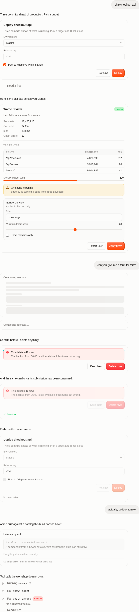

# Generative UI

Ephemeral interfaces in the chat: Lena answers with a form, a table, or a picker instead of prose.
She writes JSX against a whitelisted catalog, the DO evaluates it in a sandboxed isolate, and only
a validated `{type, props, children}` JSON tree reaches the client. See
`docs/cloudflare-os-integration.md` § "Generative UI" in the design repo.

**Nothing executable crosses the wire.** No handlers, no closures, no component code — a prop is a
literal, a `{"$bind": "path"}` marker, or JSON built from those. This module renders that tree
against components *it* owns. The backend's parent realm is the authoritative security boundary:
it independently re-validates and normalizes the isolate's returned component names, prop schemas,
bindings, JSON shape, node budget, and byte budget before persistence. Validation inside the model's
isolate exists only to produce faster, friendlier tool errors. The client validates again so old or
future durable rows degrade safely, but does not substitute for the parent check.

## Layers

| file | role |
| --- | --- |
| `validate.ts` | Narrows and bounds an untrusted recorded tree. Not the security boundary — the reason the renderer can be total. |
| `bind.ts` | `$bind` paths: read, immutable write, prop resolution. Pure. |
| `props.ts` | Prop coercion. Every reader answers with something usable rather than failing. |
| `catalog.tsx` | The 16 components, built on the app's own primitives. |
| `TreeRenderer.tsx` | The walk. Unknown names become inert placeholders that still render their children. |
| `state.ts` | Local-first bound state, debounced mirroring, one-shot submission. |
| `client.ts` | The two-call backend interface, plus the recording double the tests and harness use. |
| `liveCard.ts` | Which recorded interface, if any, is still live. |
| `jsxSkeleton.ts` | A skeleton read off still-streaming JSX. Deliberately not a parser. |
| `GenerativeUiCard.tsx` | The card: composing, live, frozen. |
| `harness/` | Dev-only QA page. Not in the app bundle. |



`CATALOG.md` is the prop-level contract — the half of the wire agreement the tool description in
`workshop-backend` has to teach the model.

## Why the catalog is hand-built rather than kumo components

Kumo is the app's design system, and this module uses it: `Button` and `Input` come through
`components/WorkshopControls`, which is the workshop's own kumo wrapper at the transcript's type
scale. But kumo's default control size is 36px tall with 16px text — sized for app chrome, next to
a transcript whose body text is 13px and whose rows are 20px. A generated form built from stock
kumo would tower over the hand-built cards beside it, and `size="sm"` (26px, 12px text) reads as a
dense settings table instead.

So the rule is: **reuse the app's primitives where the app has one at this scale, and otherwise use
the app's class vocabulary.** Every colour, border, radius and focus ring is a kumo token
(`bg-kumo-base`, `border-kumo-line`, `focus:ring-kumo-ring/15`), so light and dark, and any future
accent change, follow automatically. `Select`, `Checkbox` and `Slider` are native elements styled to
match `WorkshopInput` — deliberate for `Select`, whose kumo version portals a listbox anchored to a
row inside a scrolling transcript.

## The interaction model

There are exactly two things a generated interface can do.

1. **Write a state path.** A control whose value prop holds `{"$bind": "path"}` reads that path and
   writes back to it. Edits land in React state immediately and are mirrored to the DO on a
   trailing 400ms edge; the backend is never between a keystroke and the character appearing, and a
   failed mirror write is invisible because the next edit resends the whole state.
2. **Submit.** A `Button` hands its `action` string and the current state to the agent. That is
   awaited and reported, and it freezes the card for good.

There is no third thing, and no way for a model to author one.

## Freezing

`liveCard.ts` decides. An interface is live if it is the newest one in the chat *and* nothing has
been said since — which needs no extra state on either side, because submitting produces a turn,
and a turn appends messages after the card. Reload mid-form and the card is still live; reload
after submitting and it isn't; scroll up and every past interface is read-only with the values it
carried.

A frozen card dims slightly, disables its controls, and says why in a single footer line. It stays
legible: a submitted form the user can't read back is worse than one they can't edit.

## Wiring

`ChatInterface` places the cards. Successful `renderUI` calls and calls to tools outside
`AI_TOOL_NAMES` are filtered out of the collapsed work row (`isSelfCardingToolCall`) and rendered as
cards above it; a *failed* `renderUI` stays in the work row with its error, like any other tool.
While the arguments stream, `ComposingUiCard` shows the shimmer and — if the backend streams the
`jsx` field through `toolCodeDelta`, as `executeCode` already does — a skeleton of the components
named so far.

The module reaches the backend through two `Overseer` methods, `setGenerativeUiState` and
`submitGenerativeUiAction`.

## QA

```bash
pnpm --filter @gadgets/workshop-frontend test:run   # unit tests
pnpm dev-client                                    # then open /genui-harness.html
```

The harness puts every card state next to fake transcript chrome — agent lines, user bubbles, a
collapsed work row — because a card judged on a blank page looks fine and then turns out to be two
pixels too loud in the actual conversation. `window.__genui` drives it:

```js
__genui.scenes()          // ["sparse", "dense", "composing", "frozen", …]
__genui.show("dense")
__genui.theme("dark")     // or "light"
__genui.submissions()     // what the recording client was told
```

Fixtures live in `harness/fixtures.ts` and are shared with the tests, so the thing screenshotted and
the thing asserted on are the same thing.
